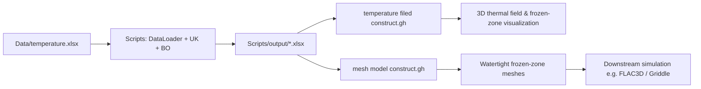

# A Bayesian-Optimized Scan-to-Simulation Framework for 3D Thermal Digital Twins of Seasonally Frozen Tailings

This repository contains the source code, data, and parametric models for the 3D digital reconstruction framework of seasonally frozen tailings. By integrating Bayesian-optimized anisotropic Kriging with Building Information Modeling (BIM), this repository provides a reproducible, data-driven workflow for spatial thermal analysis and topological geometric reconstruction in a digital twin context.

The workflow seamlessly bridges spatial geostatistics and numerical simulation. It combines:

- **Python-based Universal Kriging** with Bayesian optimization for automated, objective borehole temperature interpolation.
- **Grasshopper/Rhino parametric workflows** for 3D thermal field visualization and automated watertight mesh generation of seasonally frozen zones.

This repository is organized to support the methodology and Data Availability statement of our related manuscript.

**Repository URL:** https://github.com/GuoshunLv/3D-Thermal-Digital-Twin-Framework

---

## Repository Structure

```text
3D-Thermal-Digital-Twin-Framework/
├─ Data/
│  ├─ temperature.xlsx
│  └─ kriging_optimization_results_Universal_gaussian_consider_rss.xlsx
├─ Grasshopper/
│  ├─ temperature filed construct.gh
│  └─ mesh model construct.gh
├─ Scripts/
│  ├─ main.py
│  ├─ data_loader.py
│  ├─ universal_kriging_bayesian_rss.py
│  ├─ requirements.txt
│  ├─ README.md
│  ├─ data/                 # optional local copy of input workbook
│  └─ output/               # optimization results (generated at runtime)
└─ README.md
```

| Path | Description |
|------|-------------|
| `Data/temperature.xlsx` | Multi-sheet borehole temperature observations (one sheet per borehole). |
| `Data/kriging_optimization_results_Universal_gaussian_consider_rss.xlsx` | Example/reference output of Bayesian-optimized Universal Kriging (Gaussian variogram, RSS objective). |
| `Scripts/` | Python implementation: data loading, LOO cross-validation, Bayesian hyperparameter search, Excel export. |
| `Grasshopper/` | Parametric Rhino/Grasshopper definitions for thermal-field visualization and frozen-zone mesh reconstruction. |

---

## Workflow Overview

The full **Scan-to-Simulation** pipeline consists of two interconnected parts:

### 1. Numerical Interpolation & Optimization (Python)

Multi-sheet borehole temperature observations are interpolated at target elevations. To handle directional spatial heterogeneity under sparse data conditions, Universal Kriging parameters—including **anisotropy scaling** and **anisotropy angle**—are automatically calibrated via a Bayesian search strategy (`scikit-optimize` `gp_minimize`) to minimize prediction residuals (RSS).

### 2. Topological Reconstruction & Visualization (Grasshopper)

The optimized spatial data are imported into a parametric BIM environment to generate the 3D thermal distribution and automatically reconstruct closed, simulation-ready volumetric meshes for the seasonally frozen zones.



---

## Requirements

### Python (Part A)

- **Python 3.8+**
- Packages in `Scripts/requirements.txt`:
  - `numpy`, `pandas`, `scipy`, `openpyxl`
  - `scikit-learn`, `scikit-optimize`
  - `PyKrige`

### Rhino / Grasshopper (Part B)

- **Rhino 7 or 8** with **Grasshopper**
- Optional plugins depending on your export path (e.g., tools for mesh export to numerical engines such as **Griddle** or **FLAC3D**)

---

## Part A: Python Code (Interpolation + Optimization)

### 1. Environment Setup

```bash
cd Scripts
pip install -r requirements.txt
```

### 2. Input Data Format

The data loader expects a **single Excel workbook** with **one sheet per borehole**.

- **Bundled dataset:** `Data/temperature.xlsx`
- **Default path in `main.py`:** `Scripts/data/temperature2.xlsx` (if missing, the script prompts for a path)

**Data arrangement within each sheet** (0-based row/column indices used in code):

| Index | Content |
|-------|---------|
| Row `2` onward | Observation records |
| Column `2` | Temperature values |
| Column `3` | Depth / sampling elevation used for interpolation |
| Row `2`, column `4` | Borehole **X** coordinate |
| Row `2`, column `5` | Borehole **Y** coordinate |

**Implementation note:** `Scripts/data_loader.py` uses positional indexing (`iloc`), not column header names. Header language (e.g., Chinese or English) therefore does **not** affect parsing, provided column order is unchanged.

**Coordinate system:** `data_loader.py` applies site-specific offsets when converting raw coordinates to the local modeling frame:

```python
x_local = x_raw - 466550 - 143.247864
y_local = y_raw - 5246028 + 3.860982
```

Adjust these constants in `data_loader.py` if you reuse the workflow at a different site or CRS.

### 3. Main Execution

```bash
cd Scripts
python main.py
```

The script iterates over user-defined target elevations and variogram models, and writes **one summary Excel file per variogram model** to `Scripts/output/`.

**Key configurations** in the `if __name__ == "__main__":` block of `Scripts/main.py`:

| Parameter | Role | Example in repository |
|-----------|------|------------------------|
| `path` | Input workbook path | `Scripts/data/temperature2.xlsx` or `../Data/temperature.xlsx` |
| `heights` | Target elevation sequence | `np.arange(440.0, 482.2, 0.2)` |
| `models` | Variogram models to evaluate | `["gaussian"]`, `["exponential"]`, `["spherical"]`, … |
| `n_calls` | Total Bayesian optimization iterations | `350` |
| `n_initial_points` | Random initial evaluations before GP-guided search | `200` |
| `data_percentage` | Fraction of samples used per elevation | `1.0` |

**Example — point `main.py` to the bundled data:**

```python
path = Path(__file__).resolve().parent.parent / "Data" / "temperature.xlsx"
```

### 4. Algorithm Details

`Scripts/universal_kriging_bayesian_rss.py` implements:

1. **2D Universal Kriging** (`PyKrige.UniversalKriging`) at each target elevation.
2. **Leave-one-out cross-validation** at observation locations.
3. **Bayesian optimization** (`gp_minimize`) over:

   | Parameter | Search bounds (as implemented) |
   |-----------|--------------------------------|
   | Sill | 1.0 – 300.0 |
   | Range | 100 – 3000 |
   | Nugget | 0.1 – 1.0 |
   | Anisotropy scaling | 1.0 – 5.0 |
   | Anisotropy angle (°) | 0.0 – 180.0 |

4. **Objective function:** minimize **RSS** (Residual Sum of Squares) from LOO predictions.

**Per-elevation processing (`data_loader.py`):**

- For each borehole sheet, temperature at elevation `h` is obtained by **linear interpolation** along the depth/elevation column when `h` lies within `[h_min, h_max]`.
- Valid boreholes contribute one `(x, y, T)` sample to the 2D Universal Kriging dataset.

### 5. Output Files

**Runtime exports** (generated by `main.py`):

- Directory: `Scripts/output/`
- Filename pattern:  
  `kriging_optimization_Universal_<model>_rss_<data_percentage>.xlsx`

**Columns exported per elevation:**

`Optimizer Type`, `Model`, `Height`, `Sill`, `Range`, `Nugget`, `Scaling`, `Angle`, `Combined Objective`, `RSS`, `TSS`, `R_squared`, `Mean Residual`, `Variance Residual`, `Covariance`, `n_calls`, `n_initial_points`, `n_iterations`, `best_fun`

**Reference result** (included for reproducibility / comparison):

- `Data/kriging_optimization_results_Universal_gaussian_consider_rss.xlsx`

### 6. Module Reference

| File | Role |
|------|------|
| `main.py` | Batch driver over elevations; aggregates metrics; writes Excel summaries |
| `data_loader.py` | Reads multi-sheet workbook; builds `(x, y, T)` at elevation `h` |
| `universal_kriging_bayesian_rss.py` | Universal Kriging, LOO CV, `gp_minimize`, optional grid prediction (`kriging_grid`) |

---

## Part B: Grasshopper Files

The `Grasshopper/` directory contains two parametric workflows that bridge spatial thermal data with BIM visualization and simulation-ready geometry.

> **Note on filenames:** The thermal-field definition is stored as `temperature filed construct.gh` (filename spelling as in this repository).

### 1. `temperature filed construct.gh`

**Purpose:** Construct and visualize the macroscopic thermal field within a BIM context.

**Typical workflow:**

- Import optimized spatial temperature arrays (from Python outputs or prepared grids).
- Map continuous thermal values onto spatial geometries in Rhino.
- Generate a depth-dependent visual representation of the overall thermal distribution.
- Identify **frozen vs. unfrozen** regions using phase-change / temperature thresholds.

**Expected outputs:**

- 3D thermal field visualization in the BIM/digital-twin scene.
- Clear delineation of seasonally frozen zones for analysis and presentation.

### 2. `mesh model construct.gh`

**Purpose:** Perform topological geometric reconstruction to build **simulation-ready 3D meshes** for seasonally frozen zones.

**Typical workflow:**

- Extract boundary contours from discrete spatial samples / level sets.
- Apply **Delaunay triangulation** and boundary topological synchronization to loft lateral surfaces.
- Produce **watertight volumetric meshes** (B-Reps) suitable for downstream coupling analyses.

**Expected outputs:**

- Closed frozen-zone volume meshes ready for export to numerical engines (e.g., via **Griddle** or **FLAC3D**).

---

## How to Use the Full Pipeline

1. **Prepare data**  
   Place or update the borehole workbook (`Data/temperature.xlsx`). Keep sheet layout and column order consistent with Part A.

2. **Optimize & interpolate**  
   ```bash
   cd Scripts
   pip install -r requirements.txt
   python main.py
   ```  
   Review results under `Scripts/output/`.

3. **Visualize thermal field**  
   Open `Grasshopper/temperature filed construct.gh` in Rhino/Grasshopper and connect the Python-derived thermal grids or equivalent inputs.

4. **Generate simulation mesh**  
   Open `Grasshopper/mesh model construct.gh` to reconstruct watertight meshes for frozen regions.

5. **Export for simulation**  
   Export final 3D meshes to your preferred numerical platform (e.g., Griddle, FLAC3D, or other FDM/thermal solvers).

---

## Reproducibility Checklist

- [ ] Record Python version and `pip freeze` (or conda environment export).
- [ ] Archive `main.py` settings: `heights`, `models`, `n_calls`, `n_initial_points`, `data_percentage`.
- [ ] Keep the input workbook version used for each run (`Data/temperature.xlsx`).
- [ ] Store generated files from `Scripts/output/` with run metadata.
- [ ] Document Rhino/Grasshopper version and any plugins used for `.gh` definitions.
- [ ] If translating Excel headers to English, **do not change column order** (see Part A, Section 2).

---

## License

| Component | License |
|-----------|---------|
| Code (`Scripts/`) and Grasshopper definitions (`Grasshopper/`) | [MIT License](LICENSE) |
| Data (`Data/`) | [Creative Commons Attribution 4.0 International (CC BY 4.0)](https://creativecommons.org/licenses/by/4.0/) |

See the `LICENSE` file in the repository root for full terms. When reusing datasets, please cite this repository and the associated publication.

---

## Citation & Data Availability Statement

If you use this workflow or dataset in your research, please cite the corresponding manuscript (citation to be added upon publication).

**Suggested Data Availability statement for publications:**

> The borehole temperature datasets, Python scripts for Bayesian-optimized anisotropic Kriging, and parametric Grasshopper (`.gh`) models used to construct the 3D thermal digital twins are publicly available on GitHub at: https://github.com/GuoshunLv/3D-Thermal-Digital-Twin-Framework

**Optional extended version:**

> Raw borehole temperature observations are provided as `Data/temperature.xlsx`. Python scripts under `Scripts/` implement leave-one-out Universal Kriging with Bayesian optimization of variogram and anisotropy parameters (RSS objective). Parametric Grasshopper definitions under `Grasshopper/` support 3D thermal-field visualization (`temperature filed construct.gh`) and watertight mesh reconstruction of seasonally frozen zones (`mesh model construct.gh`) for downstream numerical simulation.

---

## Contact

For questions regarding reuse, licensing, or reproduction of results, please open an issue on the GitHub repository or contact the corresponding author listed in the manuscript.
